# Awesome-Planogram-Management

  

  

## 🎯 Similar Projects to Planogram Management Software

> 🔍 **Keywords:** *Planogram Management Software, Space Planning Tools, Shelf Optimization, Category Management, Retail Merchandising, 3D Store Shelf Layouts, DotActiv Free, Open Source Planogram Solver.*

**Planogram Management Software** (also called Space Planning, Shelf Planning, or Retail Merchandising tools) helps retailers and CPG (Consumer Packaged Goods) brands design, visualize, optimize, and execute product placements on store shelves. Features typically include 2D/3D shelf layouts, product libraries with dimensions, financial analysis, shelf-space allocation, compliance checking, and integration with category management and sales data. 

Leading commercial platforms include Blue Yonder Category Management, Nielsen Spaceman, DotActiv, Quant, RELEX Space Planning, PlanoHero, SmartDraw Planograms, Scorpion Planogram, JDA Space Planning, and Space Planning by SymphonyAI.

Below is a **curated list** of notable SaaS platforms and their open-source equivalents. Since mature, production-ready open-source planogram software is currently limited, this list serves to bridge the gap between enterprise solutions and academic optimization models, prototypes, or general-purpose diagramming applications.

## 🏢 SaaS / Hosted Platforms

| Platform | Description | Pricing | Free Tier / Trial Limits | Company Size (Est. Revenue/Valuation) |
| :--- | :--- | :--- | :--- | :--- |
| **[Nielsen Spaceman](https://nielseniq.com/)** | Long-standing industry-standard planogramming tool tightly integrated with Nielsen data. (now part of Trax / NielsenIQ ecosystem) | Custom / Quote-based | No free tier; custom demo on request. | ~$3.1B Revenue |
| **[Blue Yonder Category Management / Space Planning](https://blueyonder.com/)** | Enterprise retail planning suite with advanced space and category management capabilities. | Custom / Quote-based (typically starts at ~$100,000/year for enterprise modules) | No free tier; custom demo on request. | ~$1.1B Revenue / $7.1B Valuation |
| **JDA Space Planning** / **Space Planning by SymphonyAI** | Enterprise space planning solutions used by large retail organizations (JDA is Blue Yonder heritage). | Custom / Quote-based | No free tier; custom demo on request. | ~$500M+ Revenue (Group) |
| **[RELEX Space Planning](https://www.relexsolutions.com/)** | Part of the RELEX retail planning platform, emphasizing locally optimized planograms and supply-chain integration. | Custom / Quote-based | No free tier; custom demo on request. | ~$400M+ Revenue / €5B Valuation |
| **[SmartDraw Planograms](https://www.smartdraw.com/)** | Easy-to-use diagramming tool with planogram templates and drag-and-drop shelf design. | Starts at ~$9.95/month (individual, billed annually) | No free tier; basic free trial available. | ~$25M+ Revenue |
| **[DotActiv](https://www.dotactiv.com/)** | Category management and planogram software popular with retailers and CPG teams. | Paid tiers starting at ~$80/month (Lite) up to ~$400/month | **Free tier available**: Limited to 40 products on a single-drop planogram and 20 AI credits (~10 planograms/month). | ~$5M+ Revenue |
| **[Quant](https://www.quantretail.com/)** | Space planning and planogram solution focused on retail execution. | Starts at ~€1,200 per user/year (Quant Basic) | No free tier; 14 to 30-day free trial available. | ~$3M+ Revenue |
| **[Scorpion Planogram](https://www.scorpionplanogram.com/)** | Planogram design software with 3D visualization and automation options. | Custom / Quote-based | No free tier; custom demo/trial on request. | ~$2M+ Revenue |
| **[PlanoHero](https://planohero.com/)** | Modern planogram and shelf management platform with AI-assisted features and mobile execution tools. | Lite plan starts at $199/month; custom enterprise quotes. | No free tier; 14-day free trial available (up to 1,500 SKUs). | ~$1.5M+ Revenue |

## 🔓 Open-Source Software

### ⭐️ Open-Source Repositories (Sorted by Star Count)
- **[FreeCAD](https://github.com/FreeCAD/FreeCAD)**  — Open-source 3D parametric modeler, sometimes adapted for detailed fixture and shelf visualization.
- **[Blender](https://github.com/blender/blender)**  — Open-source 3D modeling suite adapted for 3D shelf layouts and store walkthrough visualizations.
- **[QGIS](https://github.com/qgis/QGIS)**  — Powerful open-source Geographic Information System (GIS) supporting store clustering, catchment analysis, and spatial aspects of category management.
- **[Draw.io (diagrams.net)](https://github.com/jgraph/drawio)**  — Free diagramming tool that can be used to create basic 2D planograms and shelf layouts.
- **[Inkscape](https://github.com/inkscape/inkscape)**  — Professional vector graphics editor used for drawing custom shelf planning templates.
- **[Shelf-Space-Allocation (R package)](https://github.com/dsmirnov88/Shelf-Space-Allocation)**  — Academic open-source R package for retail shelf-space optimization. Developed for grocery retail research.

### 🔬 Emerging, Experimental, & Prototyping Approaches
- **Small GitHub projects** — Various community prototypes that allow designing fixtures and placing products with capacity calculations.
- **Optimization scripts & solvers** — Python/R knapsack-style solvers that allocate products to shelves based on profit, facings, and space constraints.
- **Computer vision & AI experiments** — Community research projects using reinforcement learning or image recognition to analyze retail shelf layouts.
- **Rule-based LLM generators** — Experimental pipelines using LLMs and structured formats (e.g. JSON/XML) to generate planograms from conversational merchandising guidelines.
- **[LibreOffice Draw](https://www.libreoffice.org/discover/draw/)** — General free desktop drawing tool that can be manually adapted for basic 2D planogram layouts.

### ⚠️ Reality Check & Typical Approach
There is currently **no mature, full-featured open-source alternative** that matches commercial planogram platforms in product libraries, retailer submission formats (.psa/.pln), financial analytics, multi-user collaboration, or in-store execution workflows.

Most organizations that want open-source components currently:
1. Use commercial planogram software for the core design and compliance workflow.
2. Supplement with open-source optimization scripts, data analysis (R/Python), or general diagramming tools for internal prototyping.
3. Build lightweight custom tools on top of web frameworks + canvas/WebGL for specific needs.

If you are developing or know of a promising open-source planogram project, contributions to this list are highly welcome.

---

**🤝 How to contribute**  
Fork this repository, add a new project (with link + short description + category), and open a pull request.  
Prefer actively maintained open-source projects related to planograms, retail space planning, shelf optimization, or category management tools.

**📄 License**  
This list is public domain / CC0. Feel free to copy into your own awesome list or README.

Star the projects you find useful — open tools in retail space planning are still emerging and need community support! 🛒

